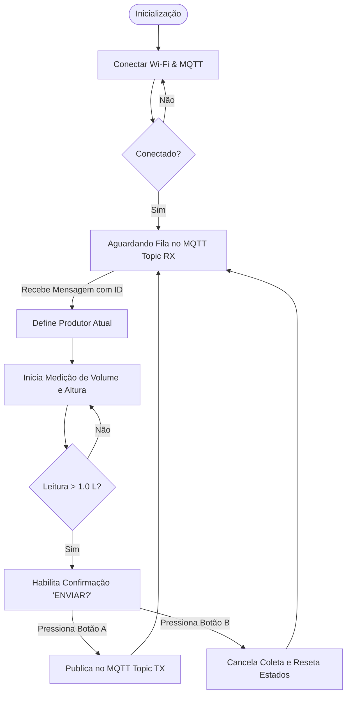

# Sistema de Medição e Envio Ultrassônico (Firmware Balança Pico W)

Este repositório contém o código-fonte do firmware para o sistema microcontrolado de medição de volume/peso de leite utilizando um sensor ultrassônico e transmissão via protocolo MQTT. O projeto é executado em um **Raspberry Pi Pico W**.

---

## 🛠️ Arquitetura de Hardware e Conectividade

O sistema interage com diversos periféricos conectados aos seguintes pinos:

### Pinos e Conexões

| Periférico | Função | Pino GPIO |
| :--- | :--- | :--- |
| **LED RGB** | Sinalização de Status (Vermelho) | `13` |
| **LED RGB** | Sinalização de Status (Verde) | `11` |
| **LED RGB** | Sinalização de Status (Azul) | `12` |
| **Botão A** | Confirmar Envio / Ação | `5` |
| **Botão B** | Cancelar Coleta / Desativar / Menu | `6` |
| **Sensor HC-SR04** | Trigger (Gatilho Ultrassom) | `9` |
| **Sensor HC-SR04** | Echo (Retorno Ultrassom) | `8` |
| **Joystick** | Eixo X (ADC 0) / Navegação | `26` (VRX) |
| **Joystick** | Eixo Y (ADC 1) / Ajuste | `27` (VRY) |
| **Joystick** | Botão SW (Clique) | `22` |
| **Display OLED** | SSD1306 (I2C) | Configurado na biblioteca SSD1306 |

### Wi-Fi e Comunicação MQTT

O firmware utiliza a arquitetura CYW43 da Pico W para conexão Wi-Fi e a stack LwIP para o cliente MQTT.

* **Wi-Fi SSID:** `LabSS`
* **Wi-Fi Senha:** `$3nh4@L@8`
* **Broker MQTT:** `10.1.1.33` (Porta `1883`)
* **Tópicos MQTT:**
  * **Inbound (`TOPIC_RX`):** `sertao_serido/fila` (Recebe solicitações de coleta contendo o ID do produtor)
  * **Outbound (`TOPIC_TX`):** `sertao_serido/leite` (Publica os dados da pesagem em formato JSON)

---

## 🚦 Tabela de Sinalização de Status (LED RGB)

O status de funcionamento do sistema é indicado visualmente através do LED RGB:

| Estado do LED | Status Indicado | Descrição |
| :--- | :--- | :--- |
| 🔴 **Vermelho** | `desconectado` | Dispositivo desconectado do Wi-Fi/MQTT ou Coleta Cancelada. |
| 🔵 **Azul** | `conectado` | Conectado ao Wi-Fi/MQTT (Pronto para operação). |
| 🟢🔵 **Ciano** | `apto` | Coleta ativa atribuída e pronta para início da medição. |
| 🔴🟢 **Amarelo** | `medindo` | Leitura de distância/volume ativa e em andamento. |
| 🟢 **Verde** | `enviando` | Publicação do peso efetuada com sucesso no MQTT. |
| 🔴🔵 **Violeta** | `mqtt` | Handshake/Conexão estabelecida com o broker MQTT. |
| **Desligado** | `off` | Modo de envio desativado ou transição de estados. |

---

## ⚙️ Funcionamento e Fluxo do Software

O programa opera através de uma máquina de estados baseada em um loop principal e interrupções temporizadas.

### 1. Inicialização e Conexão
* O sistema configura os pinos digitais, as portas ADC do joystick e inicializa o display OLED.
* Tenta se conectar à rede Wi-Fi configurada. Em seguida, estabelece conexão com o broker MQTT e se inscreve no tópico de entrada `sertao_serido/fila`.
* Um timer periódico configurado a cada **100ms** monitora continuamente o acionamento dos botões (A e B).

### 2. Fluxo de Pesagem (Menu Principal - `menu == 0`)
* **Estado Inativo:** Se nenhuma coleta foi requisitada, a tela exibe `"ATIVO / Aguardando"` (se o botão B estiver ativo) ou `"DESATIVADO"` (desativando leituras do sensor).
* **Entrada de Fila:** Ao receber uma mensagem MQTT com o JSON `{"id": "NomeProdutor"}`, o sistema extrai o ID, armazena no buffer `nome_atual`, define `aguardando_peso = true` e altera o LED para Ciano (`apto`).
* **Medição Ultrassônica:** O sensor calcula a distância medindo o tempo de resposta do pulso acústico (através de `medir_distancia_cm()`). É calculada uma **média móvel** das últimas 5 amostras para suavizar flutuações.
* **Cálculo de Volume:** O volume de leite em litros é deduzido a partir da distância suavizada usando as dimensões internas do tanque configurado na função `volumeLeite()`:
  $$\text{Altura do Leite} = \text{Calibrador} - \text{Distância Medida}$$
  $$\text{Volume (L)} = \frac{\text{Largura (79 cm)} \times \text{Comprimento (120 cm)} \times \text{Altura do Leite (cm)}}{1000}$$
* **Confirmação e Envio:** 
  * Se o volume calculado for superior a **1.0 L**, a tela exibe `"ENVIAR?"`.
  * Ao pressionar o **Botão A**, o firmware publica a mensagem no formato `{"id": NomeProdutor, "peso": PesoCalculado}` no tópico `sertao_serido/leite`, exibe `"ENVIADO"` na tela por 2 segundos e limpa os estados para aguardar o próximo produtor.

### 3. Cancelamento de Coleta (Botão B)
* Se uma coleta estiver ativa (`aguardando_peso == true`), o **Botão B** funciona como botão de cancelamento.
* Ao soltar o botão B, a flag `cancelar_coleta` é ativada.
* O loop principal limpa todos os dados medidos, define o ID de volta para `"Aguardando"`, desliga os sensores e exibe no OLED a mensagem `"CANCELADO"` por 2 segundos com sinalização visual no LED vermelho. O sistema então retorna ao estado pronto inicial.

### 4. Menu de Configurações (`menu == 1` e `menu == 2`)
Quando o sistema de envio estiver **desativado** (Botão B pressionado fora de uma pesagem ativa):
* O joystick pode ser movido para a direita ou esquerda para navegar pelos menus.
* **Menu 1 (ALT. SENSOR):** Permite reajustar a altura física em que o sensor foi instalado em relação ao fundo do recipiente (variável `calibrador`), movendo o joystick para cima ou para baixo.
* **Menu 2 (ID COLETA):** Exibe a identificação do produtor atual registrado no dispositivo.
